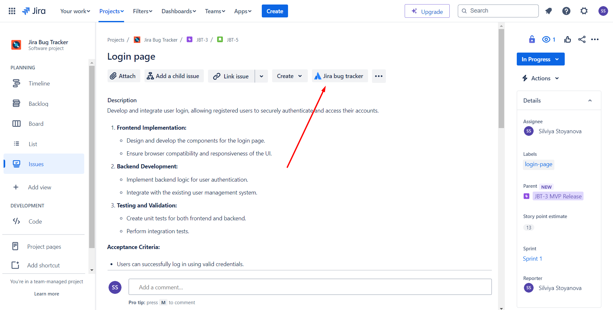
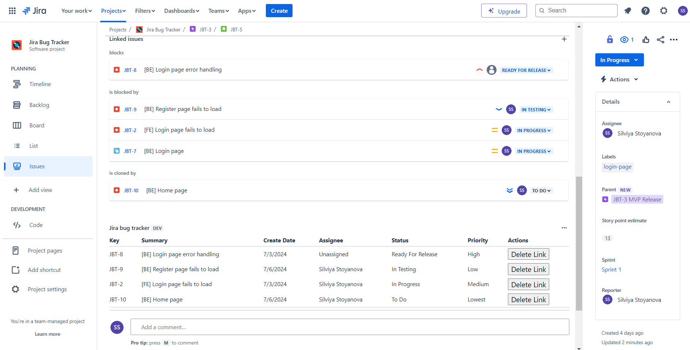

# Jira Bug Tracker

This app displays a panel in the Jira Issue View showing all bugs linked to the current issue. You can see details like Key, Summary, Create Date, Assignee, Status, and Priority. You can also sort the issues and delete the links when necessary.

## Getting Started

Here's how you can set it up and run it:

### Prerequisites

Before you start, make sure you have these installed:

- [Node.js](https://nodejs.org/)
- [Forge CLI](https://developer.atlassian.com/platform/forge/getting-started/)

### Installation

1. **Clone the Repo**

   Clone this repository to your local machine:

   ```sh
   git clone https://github.com/silviya-stoyanova/jira-bug-tracker.git
   cd jira-bug-tracker

   ```

2. **Install Dependencies**

   Navigate to your project directory and install the necessary dependencies:

   ```
   npm install
   ```

### Configuration

1. **Forge Login**

   Make sure you’re logged into the Forge CLI:

   ```
   forge login
   ```

2. **Create Your App**

   Register a new Forge app:

   ```
   forge register
   ```

### Setting Up Custom Status Labels in Jira

1. **Access Jira Administration:** Log in to your Jira instance with administrative privileges.
2. **Navigate to Statuses Configuration:** Go to Project Settings > Issue Types > Edit Workflow.
3. **Add New Statuses:**
   - **In Testing**:
     - Name: In Testing
     - Category: "In Progress"
   - **Ready For Release**:
     - Name: Ready For Release
     - Category: "In Progress"

### Running Jira Bug Tracker

1. **Deploy**

   Deploy to Forge using the following command:

   ```
   forge deploy
   ```

2. **Install this app in Jira**

   Install it in your Jira instance:

   ```
   forge install
   ```

3. **Running Locally**

   If you want to develop and test locally, you can use Forge tunnel:

   ```
   forge tunnel
   ```

   This will start a tunnel and allow you to see your changes in real-time in your Jira instance. You need to deploy again after making changes.

### Using Jira Bug Tracker

1. **Navigate to an Issue**: Open any issue in your Jira project.
2. **Link Issues**: Click _Link issue_ button and link a bug.
3. **Open Jira Bug Tracker**: Click on _Jira Bug Tracker_ button at the top of the page, next to the _Link issue_ and _Create_ buttons.
4. **View Linked Bugs**: Scroll to the bottom of the page, wait for the Jira Bug Tracker to load and you will see all the linked bugs.
5. **Sort Data**: Click on the title of any column to sort the data.
6. **Delete Link**: Click _Delete Link_ button to remove the link to a bug.

### Note

- When new bugs are linked, they will be visible inside the table after refreshing the page.

### Example usage:



### All of the linked bugs ordered by priority:


